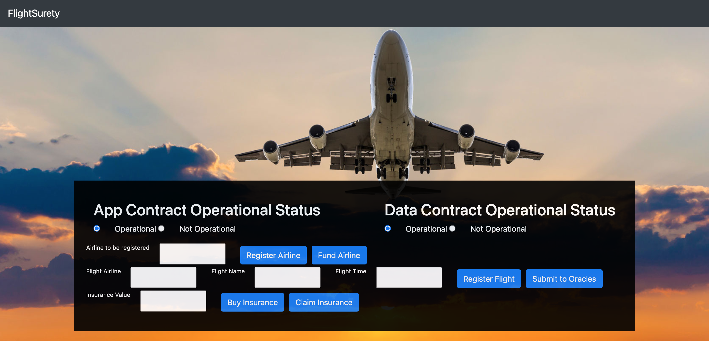

# FlightSurety

FlightSurety is a sample application project for Udacity's Blockchain course.

## Install

This repository contains Smart Contract code in Solidity (using Truffle), tests (also using Truffle), dApp scaffolding (using HTML, CSS and JS) and server app scaffolding.

To install, download or clone the repo, then:

`npm install`
`truffle compile`

## Develop Client

To run truffle tests:

`truffle test ./test/flightSurety.js`
`truffle test ./test/oracles.js`

To use the dapp:

`truffle migrate`
`npm run dapp`

To view dapp:

`http://localhost:8000`

## Develop Server

`npm run server`
`truffle test ./test/oracles.js`

## Libraries versions
Node: v16.4.0
Truffle: v5.4.0

## How to use 

1. truffle compile 
2. truffle migrate --network localhost
3. ganache-cli -m "key" -a 50
4. npm run server
5. npm run dapp

In a browser, go to `http://localhost:8000`. 

The dapp looks like this: 

1. Fund the first airline (second account from ganache). 
2. register a flight by filling the three corresponding forms. 
3. from a passenger account (different from the airline), buy an insurance (below or equal to 1 eth).
4. Submit to oracles.
5. Claim insurance.

You can add other airlines. Once multi-party consensus is operational, you can only vote for one airline at a time, i.e, if airlines are voting for airline A to be resitered, don't try to vote for airline B.
